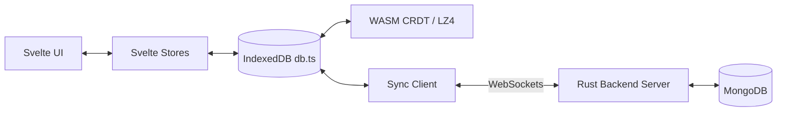

# Local-First & CRDT Synchronization Guidance

This project is built as a **local-first** application. Data is saved locally in IndexedDB first, and then synchronised to the Rust backend server asynchronously via WebSockets. Collaborative editing is powered by WebAssembly CRDT modules.

## Architecture Map

---

## 🛡️ Critical Safety Rules

### 1. IndexedDB and Single Source of Truth
* All read and write operations from the UI must flow through the Svelte stores or the database client helper `src/lib/db.ts`.
* Never perform raw direct IndexedDB mutations that bypass the sync queue. Bypassing the queue will result in data divergence between local client databases and the server.
* Ensure all IndexedDB changes are covered by unit tests similar to `src/lib/db.unit.test.ts`.

### 2. UUID Enforcement
Per repository rules: **"อะไรที่เกี่ยว id ให้ใช้ uuid เท่านั้นนะจะได้ง่าย"**
* All database models, task IDs, member IDs, and project IDs must use UUIDs.
* In Rust backend: Use `uuid::Uuid::new_v4()` or UUID v7 for sequential temporal ordering.
* In Svelte/TS frontend: Generate UUIDs using the browser's crypto API (`crypto.randomUUID()`) or matching uuid library.

### 3. WebAssembly Interaction
The project uses three WebAssembly packages:
1. `wasm-crdt`: Merges concurrent edits deterministically.
2. `wasm-compress`: LZ4 compression for payload transport.
3. `wasm-search`: Local client-side full-text search.

* **WASM Memory Safety:** If a WebAssembly module returns a pointer or requires manual deallocation, ensure you call `.free()` or the appropriate cleanup function to avoid memory leaks.
* **Deterministic Merges:** CRDT operations must be commutative, associative, and idempotent. Always write tests simulating concurrent edits merged in different orders to ensure they converge to the identical state.

### 4. Offline and Reconnection States
* Ensure UI elements degrade gracefully when offline (e.g. show sync badges, disable server-only actions like user invitations).
* Sync operations must resume automatically and resolve conflicts without throwing exceptions once WebSocket reconnects.
